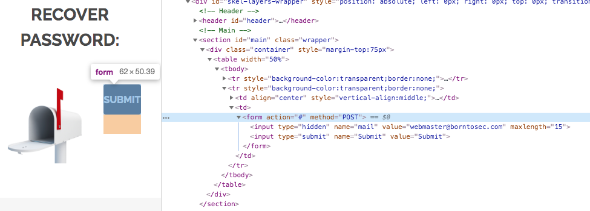

# 01_Mail_Input_Form

## Risk
On the "I forgot my password" page ```(url/?page=recover")```, if you try inspecting the ```Submit``` button, you can see that it contains an input form with a ```mail``` field with a hard input value.
Simply change the ```mail``` input value by anything (works even without a valid email adress, I tested with "test"), click ont the ```Submit``` button, and voila, you now have the desired flag.


**Flag :** 1D4855F7337C0C14B6F44946872C4EB33853F40B2D54393FBE94F49F1E19BBB0

## Usage

I don't really see any interesting use case here, except to force someone to create a new password for his account depending on how ```Recover Password``` is handled.

## Prevention
1. Ask the user for multiple pieces of hard data that should have been previously collected (generally when the user first registers).
2. After the form on Step 1 is submitted, the application verifies that each piece of data is correct for the given username. If anything is incorrect, or if the username is not recognized, the second page displays a generic error message such as ```Sorry, invalid data```.
3. Lock out the user's account immediately. Then SMS or utilize some other multi-factor token challenge with a randomly-generated code having 8 or more characters.
4. Allow user to change password in the existing session.
5. User can now log with new password.
All other sessions for this user should be invalited when a recover password occurs.

For more detail, see [**OWASP Forgot Password Cheat Sheet**](https://github.com/OWASP/CheatSheetSeries/blob/master/cheatsheets/Forgot_Password_Cheat_Sheet.md)
