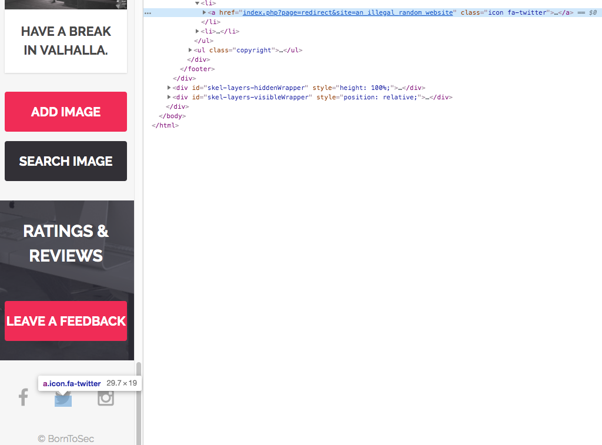

# 02_Socials_Redirect

## Risk

At the bottom of the page, you will see three social icons : Facebook, Twitter, and Instagram.\
If you try to inspect any of the 3, you can see that there is a modifiable ```href``` redirecting to the appropriate site.\
You can just modify that ```href``` in order to redirect to the site you wish (non-valid url also works).\
Click the social redirect button you just changed, and you will see the flag page with the desired result.\

By modifying untrusted URL input to a malicious site, an attacker may successfully launch a phishing scam and steal user credentials.\
Because the server name in the modified link is identical to the original site, phishing attempts may have a more trustworthy appearance.\
Unvalidated redirect and forward attacks can also be used to maliciously craft a URL that would pass the application’s access control check and then forward the attacker to privileged functions that they would normally not be able to access.\
**Flag :** ```B9E775A0291FED784A2D9680FCFAD7EDD6B8CDF87648DA647AAF4BBA288BCAB3```

## Prevention
- Explicitely declare the URL in the code (hardcode) so it can't be manipulated by an attacker.
- Do not allow the url as user input for the destination. This can usually be done. In this case, you should have a method to validate URL.
- If user input can’t be avoided, ensure that the supplied value is valid, appropriate for the application, and is authorized for the user.
- Sanitize input by creating a list of trusted URL's (lists of hosts or a regex).
- Force all redirects to first go through a page notifying users that they are going off of your site, and have them click a link to confirm.

For more detail, see [**OWASP Unvalidated Redirects and Forwards Cheat Sheet**](https://github.com/OWASP/CheatSheetSeries/blob/master/cheatsheets/Unvalidated_Redirects_and_Forwards_Cheat_Sheet.md)
