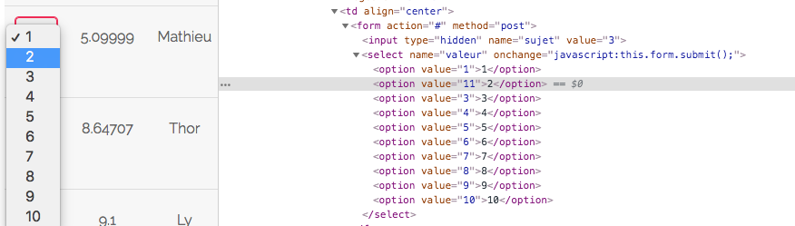

# 03_Survey_Grade_Input

## Page

```url/?page=survey```

## Risk

In the console, change one of the grade input values to any number ```> 10```\
Then, click on the appropriate line, and choose that specific grade.\
Tada, we just found another Flag.\
Need to strictly be a positive integer to be submitted, meaning it is protected against type mutations.\
You can also pass ```0```, and this will be submitted correctly despite the fact that it's not in the dropdown list.\

Data from the client should never be trusted for the client has every possibility to tamper with the data.\
The lack of validation requires a round-trip to the backend to provide an error message that the front end code could easily have eliminated.\
The back end may not be able to cope with the data payload the front-end code could have easily eliminated. For example, buffer overflows, XML injection, or similar.\
**Flag :** ```03A944B434D5BAFF05F46C4BEDE5792551A2595574BCAFC9A6E25F67C382CCAA```

## Prevention

Best solution is to use "whitelist" or "positive" validation.\
The idea is that you should check that the data is one of a set of tightly constrained known good values.\
Any data that doesn't match should be rejected.\
Data should be:
- Strongly typed at all times
- Length checked and fields length minimized
- Range checked if a numeric
- Unsigned unless required to be signed
- Syntax or grammar should be checked prior to first use or inspection
