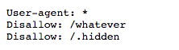
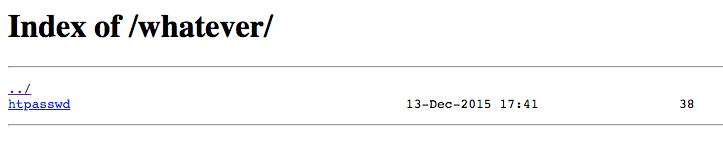

# 04_robots_whatever

## Page

```url/robots.txt```

## Risk

The robots.txt file, also known as the robots exclusion protocol or standard, is a text file that tells web robots (most often search engines) which pages on your site to crawl. It also tells web robots which pages not to crawl.\
If you go the the relevant page, you will see two routes that are disallowed : ```whatever``` and ```.hidden```.\
\
Go the the ```url/whatever``` page, and you will see an ```htpasswd``` file that you can download.\
\
Do so, and open it. You get ```root:8621ffdbc5698829397d97767ac13db3```.\
Now, go to an MD5 decrypt site, and decrypt the second part. You should obtain ```dragon```.\
Using the username and password you seem to have obtained, go to the ```url/admin``` route, and try to connect.\
Tada, got the flag and a nice image !\


**Flag :** ```d19b4823e0d5600ceed56d5e896ef328d7a2b9e7ac7e80f4fcdb9b10bcb3e7ff```

This file can be viewed by anyone, and it might contain sensitive information about the server.\
For example, specifying which directories shouldn't be indexed tells the attacker where the sensitive files are.\
In our case, you can get direct access to an admin account, meaning you can do whatever you want to the site.

## Prevention

Make sure the file DOES not contain any sensitive information.
