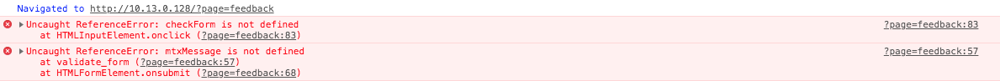

# 06_Feedback_Invalid

## Page

```url/?page=feedback```

## Risk

When trying to enter  a new feedback, you can see that we get two errors,
telling us that one variable and one function used in the code are undefined.\
\
If you look at the code, you can indeed see that the variable was declared as
```mtxMessage``` and used later on as ```mtxtMessage```.\
In the same way, the ```checkForm()``` function does not exist.\

**Flag :** ```0FBB54BBF7D099713CA4BE297E1BC7DA0173D8B3C21C1811B916A3A86652724E```

## Prevention

Code correctly ? You should never have those type of errors in the console.\
Sanitize / verify / encode all untrusted data.
